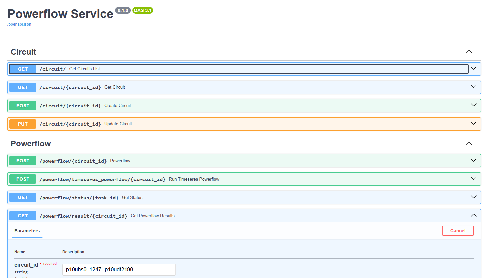

## Overview

API and distributed task queue for OpenDSS

## Dependencies

* <a href="https://github.com/fastapi/fastapi" target="_blank"><code>fastapi</code></a>
* <a href="https://github.com/celery/celery" target="_blank"><code>celery</code></a>

## Usage (running locally):

Start celery workers:
 ```console
$ python -m opendss_powerflow_service.app.workers.powerflow_worker
$ python -m opendss_powerflow_service.app.workers.circuit_worker
```

Start web server:

```console
$ fastapi dev app\main.py
```

Navigate to http://127.0.0.1:8000/docs/




## <a href="https://github.com/adinkel/opendss_powerflow_service/blob/main/examples/scripts/smartds_example.py"><code>Smart DS Example </code></a> 

An example using distribution system models from <a href="https://www.nrel.gov/grid/smart-ds.html"><code>Smart DS </code></a> 


 ```python
circuit = "p10uhs0_1247--p10udt2190"

response = requests.post(f'http://127.0.0.1:8000/powerflow/{circuit}', json={"outputs": ["voltage", "current"]})
task_id = response.json()["task_id"]

while True:
    status_response = requests.get(f'http://127.0.0.1:8000/powerflow/status/{task_id}')
    status_data = status_response.json()
    if status_data.get('status') == 'PENDING':
        time.sleep(2)
    else:
        break

if status_data.get('status') == 'SUCCESS':  
    result_response = requests.get(f'http://127.0.0.1:8000/powerflow/result/{circuit}')
    result_data = result_response.json()

    node_data = []
    for row in result_data['nodes']:
        node_data.append(json.loads(row))

    df = pd.DataFrame(node_data)
    print(df.head())
```


```console
                    circuit  id        voltb        volta                      name        voltc
0  p10uhs0_1247--p10udt2190   1  7415.543229  7415.543187  p10udt2190-p10uhs0_1247x  7415.543307
1  p10uhs0_1247--p10udt2190   2  7415.543229  7415.543187              p10udt1519lv  7415.543307
2  p10uhs0_1247--p10udt2190   3  7415.543229  7415.543187                p10ulv5448  7415.543307
3  p10uhs0_1247--p10udt2190   4  7415.543229  7415.543187              p10udt1520lv  7415.543307
4  p10uhs0_1247--p10udt2190   5  7415.543229  7415.543187                p10ulv5449  7415.543307
```